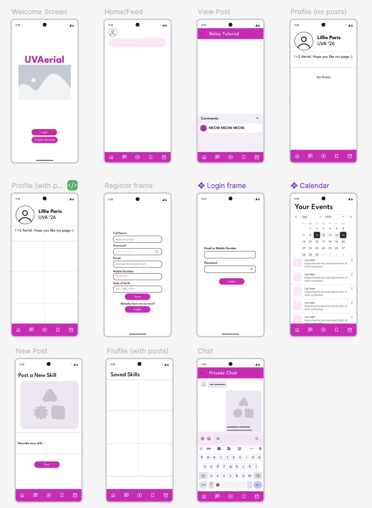

# Aerial-Dance-Club -- In Development
Mobile Application for the Aerial Dance Club at UVA, designed to allow members to share and collect aerial tutorials.

# Purpose
The Goal of UVAerial is to create a space where members of the the Aerial Dance Club at UVAcan pass down knowledge to other members. This app will provide a platform where members can post tutorials, filter and search for poses and moves, and send and receive high-quality photos and videos. 

# Components
* Account Creation
    * An account will be required to access, upload, download, and create content. A user will be required to enter a username or password for logging in, or a unique username, display name, and password for account creation.  After creating an account, the user will automatically be logged in.
* Profile Management
    * User will be able to edit their display name, delete their account, or edit/delete content they have uploaded. 
* View existing resources
    * Users can view all content they have uploaded/contributed through their profile page. 
* View resources based on the specified user
    * Users can view another user’s contributions through that user’s profile page. 
* Upload & download resources
    * Users can upload their own contributions or download those of other users. 
* Search, sort, & filter
    * Users may search for content using additional sorting and filtering options, including popularity and date published. 
* Commenting on resources
    * After accessing a specific resource, users can leave comments. They may also view other users’ comments and reply to them.
* Send messages
    * Users can forward tutorials and send pictures and videos to each other. 
* Save posts
    * Users can save posts to access them easily later.
* Poll Notification
    * Admin can send polls, and members can respond to them.
* Calendar
    * There will be a global calendar where members’ birthdays will be posted. Admin can add events. Members will be able to see when practices are

# Views
We have developed preliminary views on Figma, which we will use as a basis for implementing the application's design

